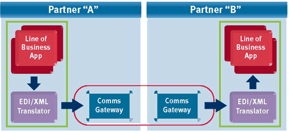

Using AS2 with Bots
===================

* `AS2 (Applicability Statement 2) <http://en.wikipedia.org/wiki/AS2>`_ is a specification about how to transport data securely and reliably over the Internet. 
* Security is achieved by using digital certificates and encryption.
* There are multiple forms of AS2, most used is AS2 over HTTP(S).
* AS2 (over HTTP) is a server protocol i.e. to use AS2 you will need an AS2-server. 
* Each partner must have their own AS2 communications gateway. 
* All AS2 software is designed to be interoperable. There are several open source implementations, as well as commercial software and hosted services.

**How to use AS2 with Bots**

Several threads in the mailing list about this:

* http://groups.google.com/group/botsmail/browse_thread/thread/b98c49f9ec9c4e8a/15e9ed6dbae987f5
* http://groups.google.com/group/botsmail/browse_thread/thread/54c7462a32fb9741/c594d71fb214b8c1
* http://groups.google.com/group/botsmail/browse_thread/thread/9bd0cc65461478b/0bbc729349392a1f

**AS2 Software**

* http://sourceforge.net/projects/mec-as2/
* http://sourceforge.net/projects/openas2/
* https://github.com/abhishek-ram/pyas2
* http://www.cecid.hku.hk/hermes.php
* http://stackoverflow.com/questions/7426951/is-anyone-using-python-for-gs1-xml-and-as2-edi

