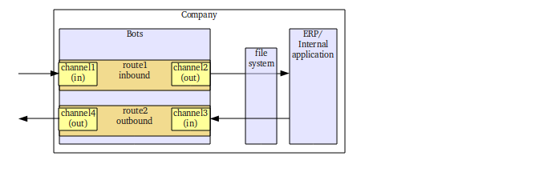

Channels
========

.. epigraph::

    Definition: Channels take care of communication with partners and backend systems using file I/O, ftp, email, etc.

A channel is either incoming or outgoing. Examples of channels:

* Receive email from a pop3-mailbox
* Send to a ftp-server
* Pick up in-house invoices from a directory on your computer
* Put orders in a file queue for import in your application.

Example of communication channels for bots:

Notes on naming conventions:

* incoming = incoming to bots
* outgoing = going out bots
* inbound = my organization receives
* outbound = going out of my organization

.. note::
    Bots does client communicates (no server). If you need a communication server (eg for ftp, as2), use a separate server.

**Index**
 
.. toctree::
   :maxdepth: 2
    
   standard-comms
   database
   channel-scripting 
   filenames
   channel-ports
   file-locking
