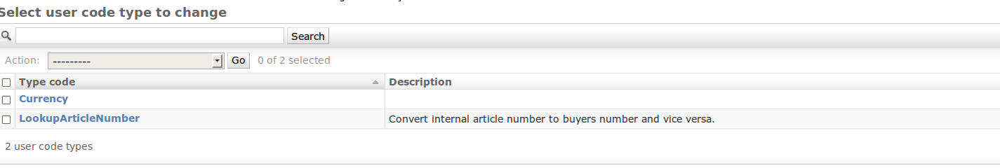
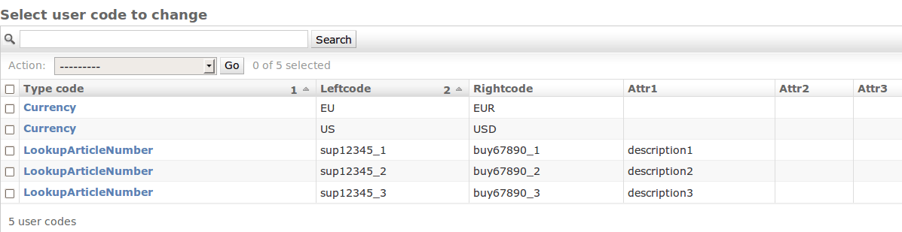

Code Conversion
===============

Bots supports code conversions. The code conversion is done in a mapping script; maintenance for the codes can be done via ``bots-monitor->Configuration->User codes as list``.
This page contains 3 examples of code conversions:

#. Convert currency code list.
#. Convert internal article code to buyers article code.
#. Convert internal article code to description.

**Code Maintenance in GUI**

First configure 2 code lists (``bots-monitor->Configuration->user codes by type``): 

Make the code conversions (``bots-monitor->Configuration->user codes as list``): 

**Code Conversion in Mapping Script**

.. code-block:: python

    import bots.transform as transform

    #convert currency code
    our_currency_code = inn.get({'BOTSID':'HEA','VALUTA':None})
    converted_currency_code = transform.ccode('Currency',our_currency_code)

    #convert internal article code to buyers article code:
    buyer_article_number = transform.ccode('LookupArticleNumber',our_article_number)

    #get description (in field 'attr1') for article
    description = transform.ccode('LookupArticleNumber',our_article_number,field='attr1')

    #code conversion also works via reverse lookup:
    our_article_number = transform.reverse_ccode('LookupArticleNumber',buyer_article_number)

**Code Conversion Functions**

**transform.ccode(codelist, value, field, safe)**

    Convert **value** to value in **field** using a user-maintained code list. Parameters:

    * *codelist*: codelist as in ``bots-monitor->Configuration->user`` codes by type.
    * *value* to be converted (should be in **leftcode**)
    * *field*: the field to lookup (if not specified: **rightcode**)
    * *safe*: if False (default): raise exception when value is in found in codelist. If True: just return **value**.

    Example of usage for leftcode to rightcode:

    .. code-block:: python

        transform.ccode('articles','8712345678906')

    Example of usage for leftcode to attr1:

    .. code-block:: python

        transform.ccode('articles','8712345678906','attr1')

**transform.reverse_ccode(codelist, value, field)**

    Same as transform.ccode(), but conversion is from **rightcode** to **field**.

**Changes in Code Conversion Functions**

These functions have changed over versions. The old functions are deprecated but still work.

.. csv-table::
    :header: "bots<2.1", "bots<3.0", "bots>=3.0"

    "codetconversion", "ccode", "ccode"
    "safecodetconversion", "safe_ccode", "ccode with parameter safe=True"
    "rcodetconversion", "reverse_ccode", "reverse_ccode"
    "safercodetconversion", "safe_reverse_ccode", "reverse_ccode with parameter safe=True"

