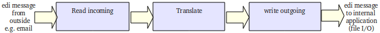

Routes
======

.. epigraph::

    Definition: A route is a workflow for edi-files

* A route determines where to get the incoming files, what to do with these edi-files (translate!) and their destination.
* ``Routes`` are the most important concept in configuring bots.
* Routes are independent: an edi-file in a route stays in that route.
* Route are configured in ``bots-monitor->Configuration->Routes``. 

To get a route like this working the following must be configured:

* The route itself in ``bots-monitor->Configuration->Routes``.
* An in-channel for incoming edi files.
* An out-channel for outgoing edi files.
* The :doc:`translation <../translation/index>`.

The route above is a simple route; files come from one source, there is one translation, one destination.
More options are possible using :doc:`composite routes <composite-routes>`.

**Index**

.. toctree::
   :maxdepth: 2

   composite-routes
   passthrough
   route-scripting
