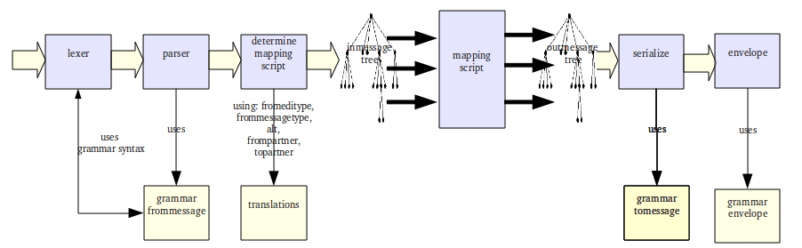

How Translation Works
=====================

Best understood by looking at this schematic:

Step-by-step:

#. The edi file is lexed and parsed using the :doc:`grammar <../grammars/index>`.
#. The message is transformed into a tree structure. This is similar to the use of DOM in xml. Advantages:
    * Easy access to message content. This is quite similar to XML-queries or X-path.
    * Choose the logic for the mapping script that is best fit for the situation - instead of being forced to 'loop' over incoming message.
    * Sorting: eg. sort article lines by article number.
    * Counting: eg. count number of lines, total amounts etc
    * Access the data you already written in the tree
#. `Split <../split-merge.html#splitting-edi-files>`_ the edi file into separate messages (eg one edi file can contain multiple orders).
#. Find the :doc:`right translation <whatwhen>` for message.
#. Run the :doc:`mapping script <../mapping-scripts/index>` for message.
#. Serialize the outmessage-tree to file. This is checked and formatted according to the :doc:`grammar <../grammars/index>` of the outgoing message.
#. Outgoing messages are `enveloped and/or merged <../split-merge.html#merge-envelope-edi-message>`_.
