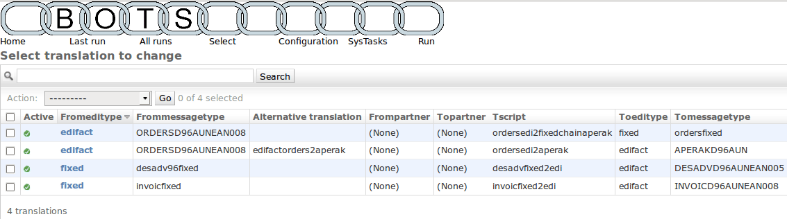

Translation
===========

.. epigraph::
    Definition: A translation translates a message of a certain editype, messagetype to another editype, messagetype

Needed for a translation:

* Translation rule in ``bots-monitor->Configuration->Translations``; see the screen shot below.
* :doc:`Grammar <../grammars/index>` for incoming message.
* :doc:`Grammar <../grammars/index>` for outgoing message.
* :doc:`Mapping script <../mapping-scripts/index>` that for converting incoming message to outgoing message.

    Screenshot of configured translations-rules

Read the 1st translation rule of this screen shot:

    Translate ``edifact-ORDERSD96AUNEAN008`` to ``fixed-myinhouseorder`` using mapping script ``ordersedifact2myinhouse.py``

**Index**

.. toctree::
    :maxdepth: 2

    howitworks
    whatwhen
    chained-translations
    multiple-versions
