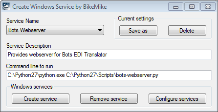

Run as Service/Daemon
=====================

.. epigraph::
    A `daemon <http://en.wikipedia.org/wiki/Daemon_%28computing%29>`_ is a computer program that runs continuously as a background process.

After Bots installation there are no service/daemon processes active. This is recommended for a production environment. Bots has several parts that you may want to run as services/daemons:

* bots-webserver.py
* bots-jobqueueserver.py (bots >= 3.0.0, is optional)
* bots-dirmonitor.py (bots >= 3.0.0, is optional)

.. note::
    bots-engine itself is not a daemon process; bots-engine is best `scheduled <run-botsengine.html#scheduling-bots-engine>`_.

How these daemons are created and managed depends on the operating system being used:

* In linux/unix, you can start them as `Linux daemons <#linux-daemons>`_.
* In Windows, you can set them up as `Windows Services <#windows-services>`_.

Linux Daemons
-------------

Below are some examples that run bots-webserver or jobqueserver as a daemon:

**Example 1**

I have been starting bots-webserver on my Linux (CentOS) servers via an entry in rc.local and wanted to provide a means to gracefully shut down the process on reboot. There have been other examples of init scripts posted which do the trick, but I wanted to put something together that conformed to LSB. I took an example script I found online and configured it for the bots.webserver process. Since CentOS doesn't handle pid files correctly when using LSB functions, I tweaked it to work around the issue, and it should work on most distributions without a lot of modification

.. code-block:: shell

    ### BEGIN INIT INFO
    # Provides:          bots-webserver
    # Required-Start:    $remote_fs $network
    # Required-Stop:     $remote_fs $network
    # Default-Start:     2 3 4 5
    # Default-Stop:      0 1 6
    # Short-Description: BOTS webserver daemon
    # Description:       BOTS webserver daemon
    ### END INIT INFO

    # Using the lsb functions to perform the operations.
    . /lib/lsb/init-functions
    # Process name ( For display )
    NAME=bots-webserver
    # Daemon name, where is the actual executable
    DAEMON=/usr/bin/bots-webserver.py
    # pid file for the daemon
    PIDFILE=/var/run/bots-webserver.pid
    # Arguments for the daemon
    ARGS="> /dev/null 2>&1 &"

    # If the daemon is not there, then exit.
    test -x $DAEMON || exit 5

    case $1 in
     start)
      # Checked the PID file exists and check the actual status of process
      if [ -e $PIDFILE ]; then
       pidofproc -p $PIDFILE $DAEMON && status="0" || status="$?"
       # If the status is SUCCESS then don't need to start again.
       if [ $status = "0" ]; then
        log_success_msg "$NAME process is already running"
        exit # Exit
       fi
      fi
      # Start the daemon.
      # Start the daemon with the help of start-stop-daemon
      # Log the message appropriately
      if start_daemon -p $PIDFILE $DAEMON $ARGS; then
       # For older LSB functions that don't handle -p argument correctly (i.e. CentOS)
       if [ ! -e $PIDFILE ]; then
        pidofproc $DAEMON > $PIDFILE
       fi
       log_success_msg "Starting the process $NAME"
      else
       log_failure_msg "Failed to start the process $NAME"
      fi
      ;;
     stop)
      # Stop the daemon.
      if [ -e $PIDFILE ]; then
       pidofproc -p $PIDFILE $DAEMON > /dev/null && status="0" || status="$?"
       if [ "$status" = 0 ]; then
        killproc -p $PIDFILE $DAEMON
        /bin/rm -f $PIDFILE
        log_success_msg "Stoppping the $NAME process"
       fi
      else
       log_warning_msg "$NAME process is not running"
      fi
      ;;
     restart)
      # Restart the daemon.
      $0 stop && sleep 2 && $0 start
      ;;
     status)
      # Check the status of the process.
      if [ -e $PIDFILE ]; then
       pidofproc -p $PIDFILE $DAEMON > /dev/null && log_success_msg "$NAME process is running" && exit 0 || exit $?
      else
       log_warning_msg "$NAME process is not running"
      fi
      ;;
     reload)
      # Reload the process. Basically sending some signal to a daemon to reload
      # it configurations.
      if [ -e $PIDFILE ]; then
       killproc -p $PIDFILE $DAEMON -signal USR1
       log_success_msg "$NAME process reloaded successfully"
      else
       log_failure_msg "$PIDFILE does not exists"
      fi
      ;;
     \*)
      # For invalid arguments, print the usage message.
      echo "Usage: $0 {start|stop|restart|reload|status}"
      exit 2
      ;;
    esac 

**Example 2**

Works on debian/ubuntu servers and uses ``start-stop-daemon``.

.. code-block:: shell

    #! /bin/sh
    #
    # uses 'start-stop-daemon' , which is used in debian/ubuntu
    #
    NAME=bots-webserver
    PIDFILE="/var/run/$NAME.pid"
    DAEMON="/usr/local/bin/bots-webserver.py"
    DAEMON_ARGS="-cconfig"

    case "$1" in
        start)
            echo "Starting "$NAME" "
            start-stop-daemon --start --verbose --background --pidfile $PIDFILE --make-pidfile --startas $DAEMON -- $DAEMON_ARGS
            ;;
        stop)
            echo "Stopping "$NAME" "
            start-stop-daemon --stop --verbose --pidfile $PIDFILE
            rm -f $PIDFILE
            ;;
        restart)
            echo "Restarting "$NAME" "
            start-stop-daemon --stop --verbose --pidfile $PIDFILE
            rm -f $PIDFILE
            sleep 1
            start-stop-daemon --start --verbose --background --pidfile $PIDFILE --make-pidfile --startas $DAEMON -- $DAEMON_ARGS
            ;;
        \*)
            echo "Usage: ""$(basename "$0")"" {start|stop|restart}"
            echo "    Starts the bots webserver as a daemon."
            echo "    Bots-webserver is part of bots open source edi translator (http://bots.sourceforge.net)."
            exit 1
            ;;
    esac

    exit 0

**Example 3**

A script for starting the job queue server as a upstart in Ubuntu. Add the following file: ``/etc/init/bots-jobqueue.conf``

.. code-block:: shell

    description "Bots Job queue server"
    author "bots@yourmail.com"

    start on runlevel [2345]
    stop on runlevel [!2345]

    respawn

    exec bots-jobqueueserver.py

Windows Services
----------------

If running Bots on a Windows server, you can create services to keep the important background processes running. This is the equivalent of a **daemon** process in Linux.

**Prerequisites**

* **srvany.exe** - This is a Microsoft utility included in the `Windows Server Resource Kit Tools <http://www.microsoft.com/download/en/details.aspx?id=17657>`_.
* **sc.exe** - The SC command is included by default in most Windows installations and is also available in the resource kit.
* Python and Bots are already installed and working, of course!

**Procedure**

* Copy ``srvany.exe`` to *C:\Windows\System32*.
* Open a command prompt and enter the following commands, according to the service required. Note: position of equal signs and spaces must be exactly as shown.

    .. code-block:: bat

        sc create "Bots Webserver" binPath= "C:\Windows\System32\srvany.exe" start= auto DisplayName= "Bots Webserver"
        sc description "Bots Webserver" "This is the webserver for Bots EDI translator."

    .. code-block:: bat

        sc create "Bots Job Queue" binPath= "C:\Windows\System32\srvany.exe" start= auto DisplayName= "Bots Job Queue"
        sc description "Bots Job Queue" "Provides job queue and launch functionality for Bots EDI Translator"

    .. code-block:: bat

        sc create "Bots Directory Monitor" binPath= "C:\Windows\System32\srvany.exe" start= auto DisplayName= "Bots Directory Monitor"
        sc description "Bots Directory Monitor" "Monitors one or more directories for new files and creates Bots jobs to process them"

* Run regedit and navigate to ``HKEY_LOCAL_MACHINE\SYSTEM\CurrentControlSet\Services\<Service Name>``
* In the right hand pane of regedit, right click, New, Key, call it ``Parameters``.
* Click the new Parameters key to select it.
* In the right hand pane, right click, New, String value, call it ``Application``.
* Double click Application, enter the command to run the required Bots script. This will vary according to your installed location and Bots version, eg.

    .. code-block:: bat

        C:\Python27\python.exe C:\Python27\Scripts\bots-webserver.py
        C:\Python27\python.exe C:\Python27\Scripts\bots-jobqueueserver.py
        C:\Python27\python.exe C:\Python27\Scripts\bots-dirmonitor.py

* Run ``services.msc`` to start/stop/configure your new services.

If any of the above doesn't make sense to you, I have created a small free utility program to do it all. This is a general purpose program for creating services. My service configuration for Bots is included; you may need to edit the paths to suit your installation. You can download the program from `here <https://dl.dropboxusercontent.com/u/43043107/CreateWinSrv.zip>`_.

**Reference links**

* http://support.microsoft.com/?kbid=137890
* http://support.microsoft.com/?kbid=251192
