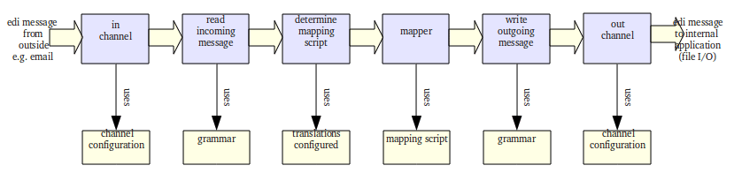

What happened
=============

**How does this ``run`` thing work?**

#. When you run bots-engine, each active route is run.
#. Per route bots will perform all configured actions (read, translate, write):
#. In bots-monitor you can view the results of the run(s), the incoming edi-files, the outgoing edi-files, etc.

**Detailed explanation**

All actions in the picture take place in the route ``myfirstroute``. The route contains:

    * an in-channel - fetches the incoming orders.
    * in the route is indicated that it should translate
    * an out-channel - transports the in-house orders to your file system.

When the incoming files have been read via the in-channel, bots starts to translate:

    * bots parses the incoming file, using the information in the route: editype=edifact, messagetype=edifact.
    * as edifact is a standard bots can find out itself that the incoming edifact file contains order messages of messagetype ORDERSD96AUNEAN008
    * bots looks in the translation table (see ``bots-monitor->Configuration->translations``) to find out what to do: what mapping script to use, to what editype and messagetype should be translated. In this case the mapping script ``myfirstscriptordersedi2fixed`` translates to editype **fixed**, messagetype **ordersfixed**.
    * the mapping script is the heart of the translation. In the mapping script the data from the incoming message is fetched and place into the outgoing message.

A complete translation in bots needs:

    * Configure of the translation (``bots-monitor->Configuration->Translations``).
    * A grammar for the incoming message. A grammar describes an edi-message: the records, sequence of the records, fields in the records, field lengths etc.
    * A mapping script. The mapping script gets data from the incoming message and puts it in the outgoing message. A mapping script is a Python script. You do not need to be proficient in Python to do this; only the basics of Python are used. And Python is a relatively easy computer language. There are a lot of good examples of mapping scripts in the plugins.
    * A grammar for the outgoing message.
